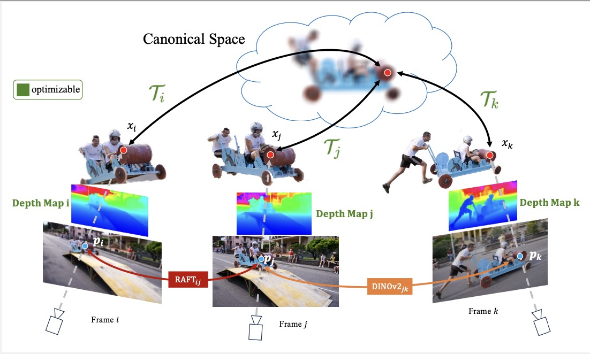

# Track Everything Everywhere Fast and Robustly

Official Implementation for paper [Track Everything Everywhere Fast and Robustly](https://timsong412.github.io/FastOmniTrack/), ECCV 2024.

[Yunzhou Song](https://www.cs.cornell.edu/~qqw/) <sup>1*</sup>,
[Jiahui Lei](https://yuyuchang.github.io/) <sup>1*</sup>,
[Ziyun Wang](https://www.cs.cornell.edu/~ruojin/) <sup>1</sup>,
[Lingjie Liu](https://zhengqili.github.io/) <sup>1</sup>,
[Kostas Daniilidis](https://www.cs.cornell.edu/~bharathh/) <sup>1,2</sup>
<br>
<sup>1</sup>University of Pennsylvania, <sup>2</sup>Archimedes, Athena RC,  <sup>*</sup>equal contribution

#### [Project Page](https://timsong412.github.io/FastOmniTrack/) | [Paper](https://arxiv.org/pdf/2403.17931)



## Installation
The code is tested with `python=3.8` and `torch=2.2.0+cu118`.
```
git clone --recurse-submodules https://github.com/TimSong412/OmniTrackFast
cd OmniTrackFast
conda create -n omni python=3.8
conda activate omni
pip install torch torchvision torchaudio --index-url https://download.pytorch.org/whl/cu118
pip install -r requirements.txt
```

## Training
1. Please refer to the [preprocessing instructions](preprocessing/README.md) for preparing input data 
   for training. We also provide some processed [data](https://drive.google.com/file/d/1iNWr4HD8E3XdnE4uShAwJy0YyBXfLrAp/view?usp=sharing) that you can download, unzip and directly train on.
   
2.  With processed input data, run the following command to start training:
    ```
    python train.py --config configs/default.txt --data_dir {sequence_directory}
    ```
    You can also only train on flow supervision without long-term matching by
    ```
    python train.py --config configs/nomatch.txt --datadir {sequence_directory}
    ```
    You can view visualizations on tensorboard by running `tensorboard --logdir logs/`. 
    By default, the script trains 100k iterations which takes less than 1 hour on a 2080Ti GPU.


## Evaluation
1. Please download the benchmark annotations used by OmniMotion [here](https://drive.google.com/file/d/1bgakkkfw_HLzAQsCVVm4Gse5Unt9fyHA/view?usp=sharing) and our checkpoints form [here](https://drive.google.com/file/d/1UxyOGX9tCAiJuf31Bx9Gd7I2O1LebZ2c/view?usp=sharing).
Please unzip the benchmark directory into the `dataset` directory as `dataset/tapvid_XXXX/annotations`
2. Run the following command to run checkpoint evaluation:
    ```
    python run_eval.py
    ```

## Implementation Details
1. Any video sequence less than 20 frames should be expanded to over 20 or longer, otherwise the NVP blocks are too many to fit the sequence.
2. We use `torch.jit` and `torch.autograd.Function` in the non-linear NVP blocks to manually accelerate the forward and backward process. You may disable the `jit` configure if any runtime error occurs.
3. Generally, a video sequence of 100 frames consumes 5GB on a 2080Ti GPU for optimization.


## Citation
```
@article{song2024track,
  title={Track Everything Everywhere Fast and Robustly},
  author={Song, Yunzhou and Lei, Jiahui and Wang, Ziyun and Liu, Lingjie and Daniilidis, Kostas},
  journal={arXiv preprint arXiv:2403.17931},
  year={2024}
}
```


